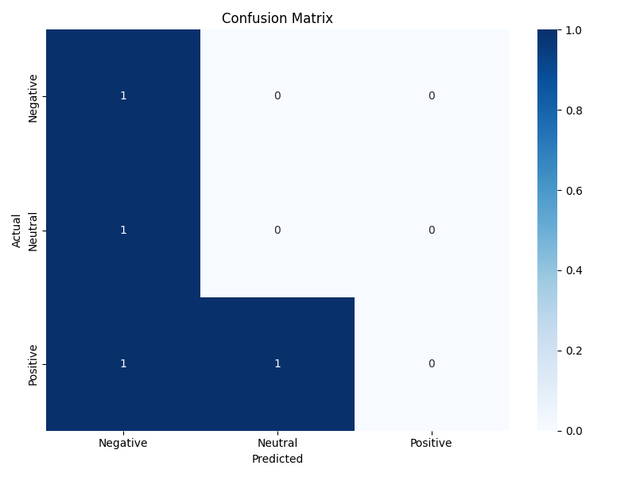

# Student Feedback Sentiment Analysis Project

A web application that uses machine learning to analyze the sentiment of student course feedback as positive, negative, or neutral.



## Project Overview

This project implements a sentiment analysis system specifically designed for educational context, analyzing student feedback to identify positive, negative, or neutral sentiments. The machine learning model processes text input and classifies the sentiment, displaying results through a user-friendly web interface.

## Features

- Text preprocessing for student feedback context
- Sentiment classification (Positive, Negative, Neutral)
- Visualization of important keywords that influenced the classification
- Interactive web interface with Flask
- Display of confidence scores for each sentiment category
- History of recent predictions
- Word cloud visualization of common terms

## Files Structure & Explanation

### Core Files

| File | Description |
|------|-------------|
| `train_model.py` | Trains the sentiment analysis model using logistic regression and TF-IDF vectorization. Includes hyperparameter tuning and evaluation metrics. |
| `app.py` | Flask web application that serves the interface, processes user input, and returns sentiment predictions. |
| `preprocess_function.py` | Contains text preprocessing functions used by both the model training and prediction processes. |
| `feedback_data.csv` | Training dataset containing student feedback text and their sentiment labels. |
| `model.pkl` | Serialized trained sentiment analysis model (Logistic Regression). |
| `vectorizer.pkl` | Serialized TF-IDF vectorizer that transforms text into numerical features. |

### Frontend Files

| File | Description |
|------|-------------|
| `templates/index.html` | Main HTML template for the web interface. |
| `static/style.css` | CSS styling for the web application. |
| `static/wordcloud.png` | Generated word cloud visualization from feedback data. |
| `static/confusion_matrix.png` | Visualization of model performance showing prediction accuracy. |
| `static/sentiment_wordclouds.png` | Word clouds separated by sentiment category. |

### Utility Files

| File | Description |
|------|-------------|
| `generate_wordcloud.py` | Script to generate word clouds from the feedback data. |

## NLP Concepts Used

### 1. Text Preprocessing
- **Tokenization**: Breaking text into words or tokens
- **Lowercasing**: Converting all text to lowercase for consistency
- **Special Character Removal**: Cleaning text of punctuation and non-alphanumeric characters
- **Stopword Removal**: Filtering out common words that don't contribute to sentiment (including domain-specific stopwords)
- **Basic Stemming**: Removing suffixes to normalize words (e.g., "learning" to "learn")

### 2. Feature Extraction
- **TF-IDF Vectorization**: Converting text to numerical features that represent word importance
- **N-gram Analysis**: Capturing sequences of up to 3 words to maintain context
- **Feature Selection**: Limiting the vocabulary to the most informative terms

### 3. Machine Learning
- **Logistic Regression**: Classification algorithm with regularization
- **Hyperparameter Tuning**: Testing different C values to optimize the model
- **Class Balancing**: Accounting for uneven distribution of sentiment classes
- **Cross-Validation**: Using stratified splits to evaluate model performance

### 4. Model Evaluation
- **Confusion Matrix**: Visualizing correct and incorrect predictions
- **F1 Score**: Measuring model performance with balanced precision and recall
- **Example-Based Testing**: Validating the model on sample feedback statements

## Project Flow

1. **Data Preparation**: Student feedback is collected and labeled in `feedback_data.csv`
2. **Model Training**: `train_model.py` preprocesses the text, converts it to TF-IDF features, and trains a logistic regression model
3. **Model Serialization**: The trained model and vectorizer are saved to disk as PKL files
4. **Web Application**: `app.py` loads the model and serves an interface where users can input feedback
5. **Prediction**: When a user submits feedback, the text is preprocessed, vectorized, and classified
6. **Visualization**: The prediction is displayed along with confidence scores and influential keywords

## How to Run the Project

### Prerequisites
- Python 3.8 or higher
- pip (Python package manager)

### Setup Instructions

1. **Clone the repository**
   ```
   git clone https://github.com/chanikkyasaai/sentiment_analysis_project.git
   cd sentiment_analysis_project
   ```

2. **Install dependencies**
   ```
   pip install -r requirements.txt
   ```
   
   Note: If requirements.txt is missing, install the following packages:
   ```
   pip install flask pandas numpy scikit-learn matplotlib seaborn wordcloud
   ```

3. **Run the web application**
   ```
   python app.py
   ```

4. **Access the application**
   - Open a web browser and navigate to: `http://127.0.0.1:5000/`
   - Enter student feedback in the text area and click "Analyze Sentiment"

### Optional: Retraining the Model

If you want to train the model with new data:

1. Update `feedback_data.csv` with your training data
2. Run the training script:
   ```
   python train_model.py
   ```
3. The script will generate a new model.pkl and vectorizer.pkl

## Current Limitations and Future Improvements

As of now, the sentiment analysis model has some limitations in classification accuracy due to the small training dataset. The model achieves approximately 25% accuracy on the test set, which leaves significant room for improvement.

### Suggested Improvements for Team Members

- **Data Enhancement**: Add more labeled training examples to improve model performance
- **Advanced Features**: Experiment with more sophisticated NLP features (word embeddings, contextual embeddings)
- **Model Architecture**: Try different algorithms like SVM, Random Forest, or neural networks
- **Parameter Tuning**: Further optimize the current model's hyperparameters
- **Domain Adaptation**: Fine-tune the model specifically for educational feedback context

## Contribution Guidelines

1. Fork the repository
2. Create your feature branch: `git checkout -b feature/new-feature`
3. Implement your changes and test thoroughly
4. Commit your changes: `git commit -m 'Add new feature'`
5. Push to the branch: `git push origin feature/new-feature`
6. Submit a pull request

## Author

This project is maintained by Chanikya Nelapatla.

For questions or support, please reach out via:
- GitHub: [@chanikkyasaai](https://github.com/chanikkyasaai)
- Email: chanikyac01@outlook.com